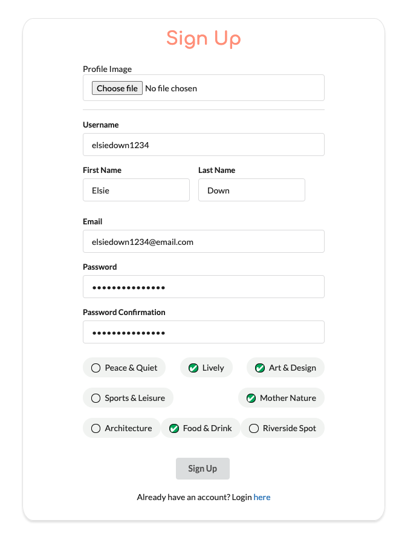
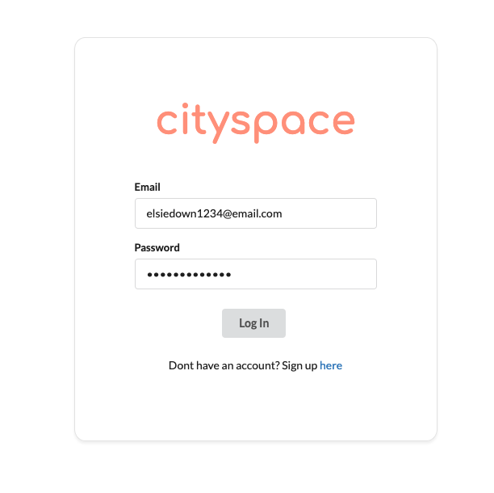
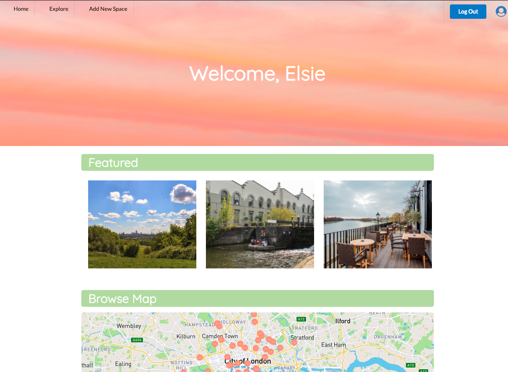
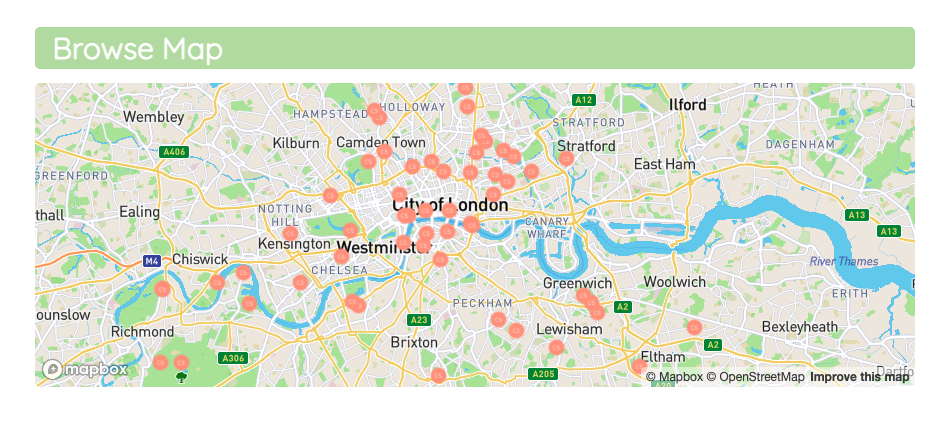
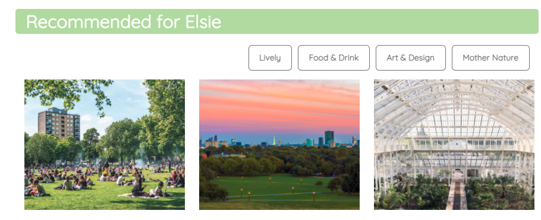
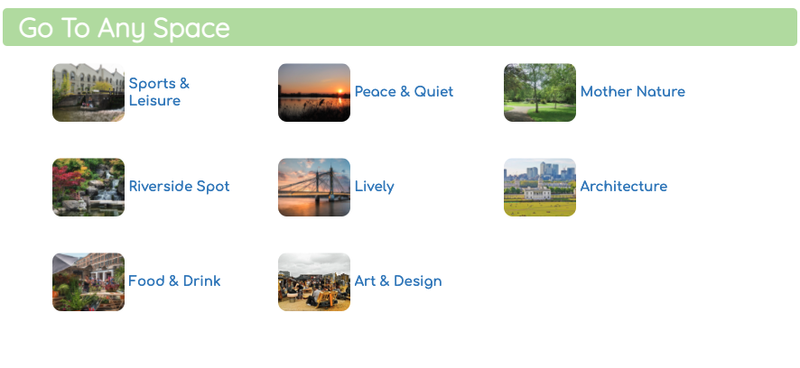
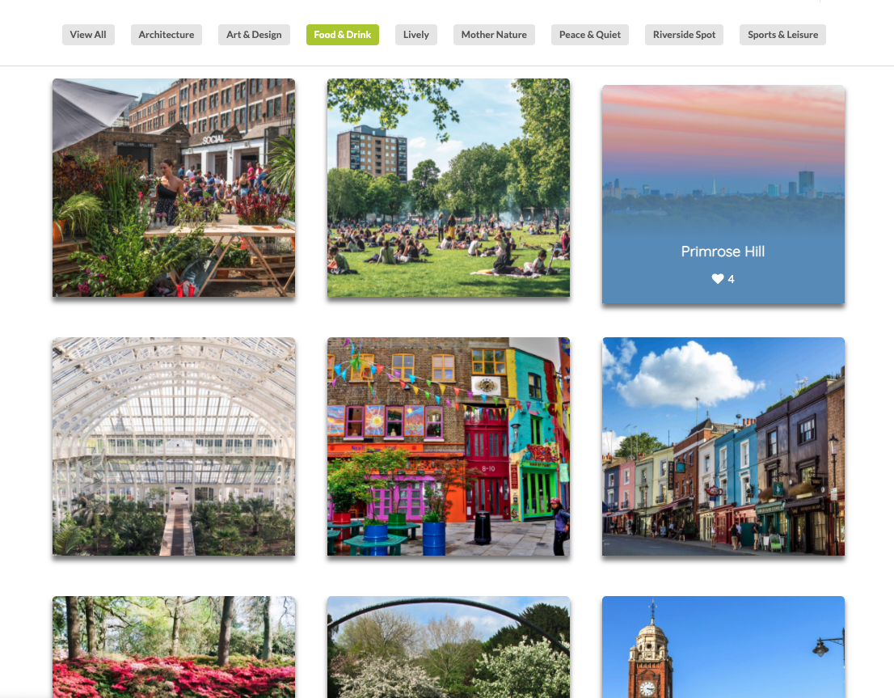
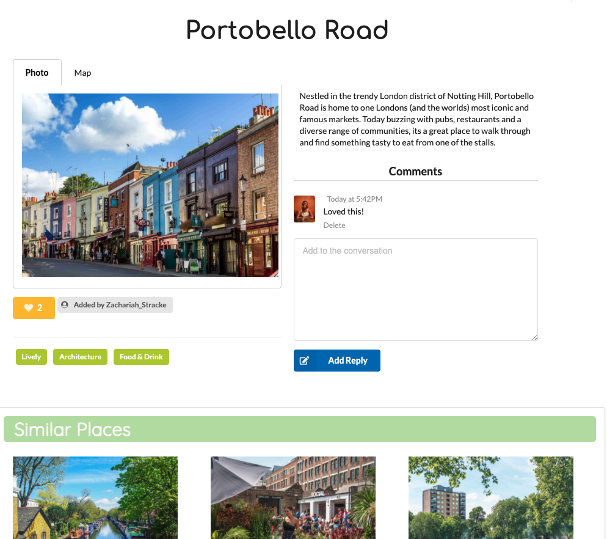
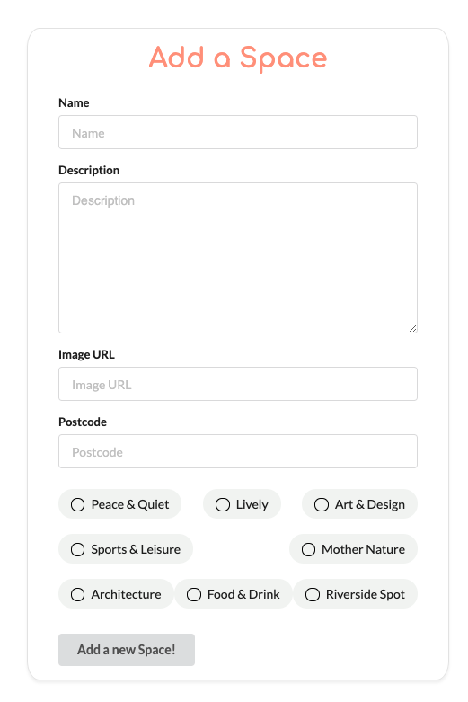
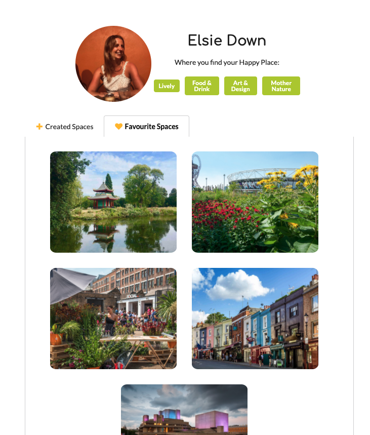

# Project 3 - cityspace

## General Assembly SEI Project 3: Full-Stack MERN Application

You can find a hosted version of our app here :  [cityspace](https://cityspace.herokuapp.com/) (deployed using Heroku)

To access all available features, please sign up for an account or use the following details:

email: elsieadmin@email.com
password: pass

## Overview

This was my third project on the General Assembly Software Engineering Immersive course.  As a group of 4, we were given a week to build a full-stack application of our choice.

Our idea was cityspace. Cityspace is a platform that encourages users to explore outdoor spaces in London. Given that we are all now spending more time outside, the app has the aim of discovering new and interesting places throughout the city. Users can sign up to our app, explore spaces based on their preferences, as well as add new spaces that they have come across. The cityspace community can then react with the different spaces - adding comments or adding the space to their favourites.

This Readme will outline the approach we took and the wins and challenges that I encountered along the way.

## Collaborators

* Tobi Lesi - [Github](https://github.com/olulesi)
* Ricky Cato - [Github](https://github.com/rickyc000)
* Edwyn Abi-Acar - [Github](https://github.com/Edwyn26)

## Brief

* **Build a full-stack application** by making your own backend and your own front-end
* **Use an Express API** to serve your data from a Mongo database
* **Consume your API with a separate front-end** built with React
* **Be a complete product** which most likely means multiple relationships and CRUD functionality for at least a couple of models
* **Implement thoughtful user stories/wireframes** that are significant enough to help you know which features are core MVP and which you can cut
* **Have a visually impressive design** to kick your portfolio up a notch and have something to wow future clients & employers.
* **Be deployed online** so it’s publicly accessible.


## Timeframe and Technologies Used

**Timeframe**: 1 week in a group of 4 developers

* React.js
* JavaScript (ES6)
* HTML5 
* Node.js
* Semantic UI React
* MongoDB
* Mongoose
* Express.js
* Yarn
* Axios
* CSS5 and SASS
* Cloudinary
* Dependencies installed: Mapbox, slick-carousel, react-router-dom, react-slick
* [Postcodes.io API](https://postcodes.io/)
* Git & GitHub
* Insomnia
* Trello
* VSCode & Eslint
* Heroku 
* Mongodb Atlas


## Features

* Landing Page
* Sign up page and Login page
* Index of all cityspaces
* Detail view for each cityspace
* View all spaces on map
* Filter by ‘type’ of space eg. 'Peace & Quiet', 'Lively' etc.
* Login & Logout with restricted visibility for logged in users
	* Create, edit and delete space
	* Ability to comment on spaces and add to favourites
	* User profile 
	* Other user profile
## The Site:

 Users can sign up, adding their details and choosing their preferences of what sort of spaces they are looking to find:



User logs in:



Upon logging in, user lands on the main homepage - which includes featured spaces, spaces recommended for that user (based on the preferences they chose), map view of all spaces, and different categories:







The categories page is another place to explore and find a space. By clicking on the different category titles at the top of the page, the results are then filtered to that category eg. 'Art & Design', 'Peace & Quiet'.  By hovering on each space - the user can see how many likes that space has as well as the name of the space. By clicking on a space, the user will be taken to the detailed view page for that space.:



The view page for each space. The user can comment on the space ( & delete the comment). The user can also favourite the space from this page as well as click on the user profile of the person who added the space, the categories linked to that space and the individual map view of that space.




A user can add a space (and again choose the categories which best describe that space):



A user can then view their profile (as well as other users) - to view the spaces they have favourited or keep track of the spaces they’ve created. Their profile also displays their favourite categories:



## Approach Taken

**Planning**

* Planning our idea and dividing the work was key to the success of the project. The first day was entirely devoted to coming up with the idea, discussing how we wanted the functionality and styling to work, and how we would divide up the work.

* Trello was an important tool that we used to keep track of our work both individually and as a group. 

* We also came up with detailed wireframes and sourced different websites (Eg. Airbnb and Pinterest) that we could use as reference points so that we had an idea of how we wanted the site to look before starting on the development side of things.

**Development**

* Once we had a detailed plan and were certain idea of what we were aiming to build, we started on the development of the site.  As all four members of our group were keen to work full-stack, started by working on the back-end as a group (in order to have a clear understanding of how the data was going to be retrieved) and then moved onto the front-end.

**Back-End**

* The first few days were spent either working as a group or in pairs, setting up the different components of the back-end.  I focussed on setting up the relationship between the spaces and the users - in particular the ‘favouriting functionality’ - ie. how a user could favourite a space and how this data would be stored on both the space and the user models.

* Within the space model, we added a ‘favouritedBy’ value which would display an array of all the users who had liked that space.


```
const citySpaceSchema = new mongoose.Schema({
  name: { type: String, required: true, unique: true },
  description: { type: String, required: true, maxlength: 800 },
  image: { type: String, required: true },
  location: { type: Object, required: true },
  owner: { type: mongoose.Schema.ObjectId, ref: 'User', required: true  },
  comments: [commentSchema],
  favouritedBy: [{ type: mongoose.Schema.ObjectId, ref: 'User', required: true  }],
  tags: [{ type: String, required: false }],
})

```

* Then on the User model, we created two virtual schemas - one for the spaces they had created and the spaces they had favourited.


```
userSchema.virtual('createdSpaces', {
  ref: 'Space',
  localField: '_id',
  foreignField: 'owner',
})

userSchema.virtual('favouritedSpaces', {
  ref: 'Space',
  localField: '_id',
  foreignField: 'favouritedBy',
})


```

* Then when it came to setting up the user profile request - we populated each user profile with both their favourite spaces and the spaces they had created.

```
async function userProfile(req, res, next) {
  try {
    const user = await User.findById(req.currentUser._id).populate('favouritedSpaces').populate('createdSpaces')
    if (!user) throw new Error(notFound)
    return res.status(200).json(user)
  } catch (err) {
    next(err)
  }
}

```

* I then moved onto how the actual favouriting functionality would work - (i.e how the user could add a space to their favourites). This was something that we had not covered in class and I enjoyed the task of figuring out how this would work: 

```
async function favouriteASpace(req, res, next) {
  const { id } = req.params
  console.log(req.params)
  try {
    const space = await Space.findById(id)
    if (!space) throw new Error(notFound)
    // const favourited = { owner: req.currentUser._id }
    space.favouritedBy.push(req.currentUser._id)
    await space.save()
    return res.status(201).json(space)
  } catch (err) {
    next(err)
  }
}

```

* Keen to populate our site with lots of different spaces, we each focussed on creating a certain number of spaces that we could seed when deploying the site. From the outset, we aimed to find high-quality images as this would add to the overall aesthetic of the site. We then assigned an owner to each space, as well as pre-populating each space with likes. To do this, we used a map function, assigning each space to one of our created users (which we created using Fakr) using a random index.


```
  const spaceDataWithOwners = spaceData.map(space => {
      const randomIndex = Math.floor(Math.random() * users.length)
      space.owner = createdUsers[randomIndex]._id
      const numberOfFavourties = Math.floor(Math.random() * 4)
      const favourites = []
      for (let i = 0; i <= numberOfFavourties; i++) {
        const randomFavouriteIndex = Math.floor(Math.random() * users.length)
        favourites.push(createdUsers[randomFavouriteIndex]._id)
      }
      space.favouritedBy = favourites
      return space
    })

```


**Front-End**

* Once we had finished on the back-end, we moved onto the development of the front-end. Similar to how we built the back-end, we decided to split the work up and then worked on the front-end in either pairs or individually. Ricky and I worked on implementing Mapbox on the front-end. We used mapbox both on the main home page (displaying all our spaces on one single map) as well as having an individual map view for each detailed cityspace page. 

* When it came to working on tasks individually, I implemented the requests and relationships I had set up on the back-end, working on how the ‘favouriting’ functionality would work on the front-end. Whilst the requests were relatively straightforward to set-up, I had some difficult updating the data on the page (eg. The number of likes // showing a  ‘liked’ icon) without having to refresh the page. In order to this, within the useEffect I checked whether the user had already liked that space or not and updating a state value to true if they had (and then within the return use that state value to set the favourite button to ‘liked’) as well as check for the number of likes for that space:

```

// State values for the favouriting functionality

const [isFavourite, setIsFavourite] = React.useState(false)
const [favourites, setFavourites] = React.useState(0)

// useEffect to check 'favourited' data: 
React.useEffect(() => {
    const getSpace = async () => {
      try {
        const { data } = await getSingleSpace(id)
        setSpace(data)
        if (data.favouritedBy.includes(getUserId())) {
          setIsFavourite(true)
        }
        if (data.favouritedBy) {
          setFavourites(data.favouritedBy.length)
        }
        if (data.comments) {
          setComments(data.comments)
        }
      } catch (err) {
        console.log(err)
      }
    }
    getSpace()
  }, [id, newComment])

// Add to Favourite Request:


 const handleFavourite = async event => {
    event.preventDefault()
    try {
      await addToFavourites(id)
      setIsFavourite(!isFavourite)
      setFavourites(favourites + 1)
    } catch (err) {
      console.log(err)
    }
    //* Add to the users favourites
  }


// The return of the favouriting section


{!isLoggedIn ?
                      <Link to='/login'>
                        <div className="ui button">
                          <Icon
                            name="heart outline"
                          ></Icon>
                          {favourites ? favourites : 0}
                        </div>
                      </Link>
                      :
                      <div className="show-page-favourites">
                        {!isFavourite ?
                          <div className="ui button" onClick={handleFavourite}>
                            <Icon
                              name="heart outline"
                            ></Icon>
                            {favourites ? favourites : 0}
                          </div>
                          :
                          <div className="ui button yellow" onClick={handleUnFavourite}>
                            <Icon
                              name="heart"
                            ></Icon>
                            {favourites ? favourites : 0}
                          </div>
                        
                        }
                      </div>
                    }


```

* I then worked on setting up the profile page, and it was really exciting and satisfying to see all the relationships (eg. created spaces and favourite spaces) showing up on the page.  For both the created and favourited spaces, I used a map (given that the amount of data would always be different for each user) to map out any spaces that were linked to that profile.
```
  <div>
                  {profile.favouritedSpaces ?
                    <div className="space-grid">
                      {profile.favouritedSpaces.map(space => (
                        <div className="space-div" key={space._id}>
                          <Link to={`/spaces/${space._id}`}>
                            
                          </Link>
                          {/* <p key={space._id}>{space.name}</p> */}
                        </div>


                      ))}
                    </div>
                    :
                    <p>{profile.firstName} hasnt favourited any spaces</p>
                  }
                </div>

```


* I also worked on the visibility of the site for whether a user was logged in or not. For example, if a user was not logged in and clicked on a user’s icon - I decided to direct them to the sign-up page in order to access these restricted features. If they were logged in, I directed them to the profile page of that user.

```
   {isLoggedIn ?
                        <div className="added-by">
                          <Link to={space.owner ? `/users/${space.owner._id}` : ''} className="ui image label">
                            <Icon name="user circle" />
                      Added by {space.owner ? space.owner.username : ''}
                          </Link>
                        </div>
                        :
                        <div className="added-by">
                          <Link to='/login' className="ui image label">
                            <Icon name="user circle" />
                      Added by {space.owner ? space.owner.username : ''}
                          </Link>
                        </div>
                      }

```


## Challenges

* Given that this was my first time working in a larger group, the main challenge was dividing the work and finding a work flow that was most efficient for all of us.  It was a challenge coordinating all the tasks over Zoom - which proved to be difficult with various internet issues. However, constant communication and updates over Slack and Trello ensured we still managed to work effectively as a group and reach our work targets.

## Wins
* I think we were all extremely happy with how the site looked by the end and how much we were able to build within the timeframe of a week. The site was exactly how we had imagined and it had a professional and clean finish to it as intended.
* A huge win was the way we worked as a group. Daily group stand-ups and clear communication between us all helped the process and made the project really enjoyable.  If anyone was ever having issues or stuck on a certain problem, we came together in a great way and solved the problem together effectively. 
* Similarly, avoiding conflicts on GitHub and the overall smoothness of the project were major wins for us all. 

## What I learned
* This was my first project working on back-end and I feel I learned a lot about how the requests were set up and creating relationships between different models.
* With regards to the front-end, I continued to develop my understanding of how RESTful routes work, as well as user authentication. I also enjoyed using 3rd-party React packages such as Mapbox.
* I inevitably learned a lot from my teammates, as well as how to work efficiently in a group.
* The project was invaluable in terms of learning how to use Git as a team - for the first few pushes, we would co-ordinate with one another and oversee each-other pushing to the development branch. I think this really helped the overall process of using Git and insured the smooth running of the project and avoiding potential problematic conflicts.

## Future Features

* If we had more time, we spoke about building the app for multiple cities - not just London.
* It would have been nice to also add the ability to see your current location and find spaces based on your current location.
* We also would have liked to have been able to add multiple photos for each space.
